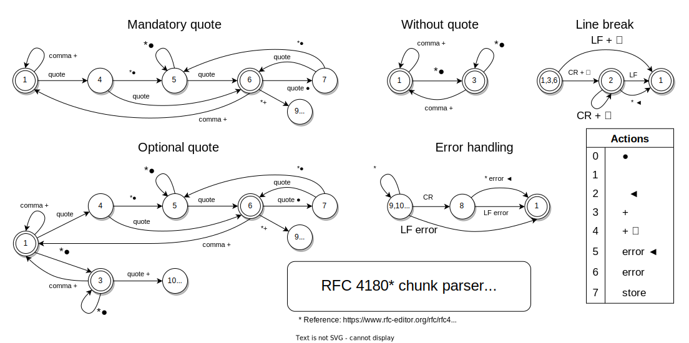

# RFC 4180 Parser

The [RFC 4180](https://www.rfc-editor.org/rfc/rfc4180) documents the
format used for Comma-Separated Values (CSV) files and registers the
associated [MIME type "text/csv"](https://www.rfc-editor.org/rfc/rfc4180#section-3)
(as per [RFC 2048](https://www.rfc-editor.org/rfc/rfc2048)). It does not
specify a standard.

The CSV format has been used for exchanging and converting data
between various programs for quite some time without a formal
definition, so many implementations implicitly define the format.

In essence the CSV format is characterized by being a tabular form,
with records separated by line breaks and record fields divided by
a separator symbol, with the fields possibly surrounded by other symbol.
The field surround symbol can be optional and inside fields it can be
escaped by two consecutive surrownd symbols. Traditionally the separator
symbol is the comma (,) and the surround symbol is the double quote (").

## Motivations

The motivations for coding a CSV parser are many and of theoretical and
practical reasons. Between them:

* The automata model to implement the parser is based in a state machine
whit default state transitions for current state and input symbol. It
means that only select input symbols must be tested to select next
state. If no one match then a default state transition for current state
is made.
* The needs of modern applications, with very different input and output
speeds, require the CSV parser to be able to process the input in
chunks, keeping the parser state between each round, to be used as a
stream transformation algorithm.
* The absense of a formal definition of CSV format means that a general
implementation (a full customizable implementation that covers all
current implementations in a coherent way) must be designed driven by
the general principle of robustness, as mentioned in RFC 4180:
> Implementors should "be conservative in what you do, be liberal in
> what you accept from others" ([RFC 793](https://www.rfc-editor.org/rfc/rfc793#section-2.10))
> when processing CSV files.

We cannot speak in a definitive implementation of a CSV parser, but we
can establish definitive guidelines for a fast and fully customizable
implementation and these guidelines may lead to a formal specification
of the CSV format.

## Implementation details

The syntax of CSV files (like sugested in [RFC 4180](https://www.rfc-editor.org/rfc/rfc4180#section-2))
can be easily implemented by a fast automata with default transictions
because only some tests must be made with input symbol to decide the
next state, with the default state transition for all other unmatched
input symbols from previous transitions. The order of input symbol test
can be choose to optimize speed considering usual inputs.

### The Automata



### Transition Table

The transition table structure is shown above

| current state | current input | next state | action |
|---------------|---------------|------------|--------|
| state         | input         | state      | action |
| state         | input         | state      | action |
| state         | input         | state      | action |
.
.
.

For implementation reasons it can be best coded as a two dimensional
array of triples [input, state, action] with the last element of
first dimension being the default transition of current state (the
transition for unmatched input symbol in current state).

```javascript
s := s0;
procedure parse(chunk: array of char)
    n := 0
    function move() : integer;
    begin
        s, n, and chunk is in scope of move
        return next state
    end;
    while n < length of chunk do
        s := move()
        n := n + 1;
    end;
end;
function accept: boolean;
    if s is in F then begin
        s:= move()
        return true;
    end
    else
        return false;
end;
```
........................................................................

### The line break problem
One or multiple characters used to delimit records; defaults to auto discovery if not provided. Supported auto discovery methods are Linux ("\n"), Apple ("\r") and Windows ("\r\n") row delimiters.
* [RFC 2045 - Session 2.1. CRLF](https://www.rfc-editor.org/rfc/rfc2045#section-2.1)
* [RFC 2046 - Session 4.1.1. Representation of Line Breaks](https://www.rfc-editor.org/rfc/rfc2046#section-4.1.1)


## References
* [RFC 4180 - Common Format and MIME Type for Comma-Separated Values (CSV) Files](https://www.rfc-editor.org/rfc/rfc4180)